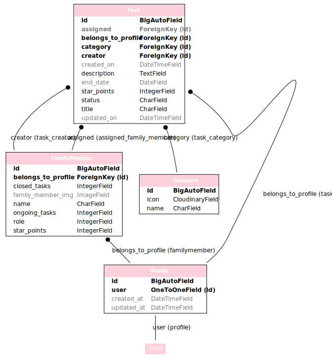
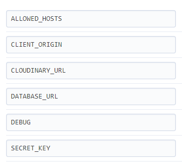

# Family Star Back-End
## Table of contents
- [Technologies used](#technologies-used)
    - [Languages](#languages)
    - [Frameworks and libraries](#frameworks-and-libraries)
	- [Databases](#databases)
	- [Storage](#storage)
    - [Other tools](#other-tools)
- [Database Scheme](#database-scheme)
- [Testing](#testing)
- [Future improvements](#future-improvements)
    - [Code](#code)
- [Deployment](#deployment)
    - [Local deployment](#local-deployment)
    - [Heroku deployment](#heroku-deployment)
- [Credits](#credits)
    - [Code](#code)
    - [Typography](#Typography)
	- [Icons](#icons)
	- [Wireframes](#wireframes)
- [Testing](#testing)
- [Future Improvements](#future-improvements)
    - [Code](#code)
- [Test](#test)

## Technologies used
### Languages
- [Python (3.8.11)](https://www.python.org/)
### Frameworks and libraries
- [Django (3.2.15) ](https://www.djangoproject.com/) - Used for core functionality 
- [Django rest framework (3.13.1)](https://www.django-rest-framework.org/)
- [Django rest auth (2.2.5)](https://django-rest-auth.readthedocs.io/en/latest/) - Used for authentication and registration
- [Django cors headers (3.13.0)](https://pypi.org/project/django-cors-headers/) - Used for allowing Cross-Origin Resource Sharing
- [Pytest (7.1.2)](https://pypi.org/project/pytest/) and [Pytest-django (4.5.2)](https://pytest-django.readthedocs.io/en/latest/) - Used for testing Python
### Databases
- [SQLite](https://www.sqlite.org/index.html) - Used as development database 
- [PostgreSQL](https://www.postgresql.org/) - Used as production database
### Storage
- [Cloudinary](https://cloudinary.com/) - Used for storing pictures
### Other tools
- [GitHub Issues](https://github.com/features/issues) - Used for project planning 
- [Gunicorn (20.1.0)](https://gunicorn.org/) - Used as inspiration when maping out categories 
- [Graphviz](https://dreampuf.github.io/GraphvizOnline/) - Used for generating pretty database schema from dot-file
- [Heroku](https://id.heroku.com/login) - Used to deploy app
- [Pyscopg2 (2.9.3)](https://pypi.org/project/psycopg2/) - Used for connecting PostgreSQL to Python 

### Database Scheme

## Testing
Read more about testing and validation [here](/testing/TEST.md)

## Future improvements
### Code
- To do maintainability easier the search and filter functionality could be moved to it's own method.
- To shorten the code generic views could been used. 
- A more well thought out models/database relations maybe could result in easier views and methods, for instance there is a lot of overriden get, create, patch etc. 
## Deployment

### Local deployment
1. Log into your GitHub account and locate this project.
2. Create your local workspace and clone the project to your folder by using CLI command “git clone https://github.com/MartinaB91/project5-task-app-back.git”
3. Install all the dependencies by using CLI command "pip 3 install -r requirements.txt"
4. Create a "env.py" file and add it to your ".gitignore" file.
5. In your env.py file, add following environ variables, SECRET_KEY and CLOUDINARY_URL
, ALLOWED_HOSTS, CLIENT_ORIGIN_DEV, DEV and DEBUG. Please use earlier settings.py file version than last production version since some values are hard coded in production version.  
6. Create a "Procfile" and add following text "release: python manage.py makemigrations && python manage.py migrate" and "web: gunicorn myblog.wsgi".

### Heroku deployment
This project is deployed to Heroku. Below the steps taken to deploy is described.

1. Create an Heroku account or sign into your account.
2. Create a new app by choosing option “Create new app”, located at the centre of dashboard (or if you’re not a new user it’s found when expanding “New” in the top right corner).
3. Give your app a name, choose a region and click “Create”.
4. Go to “Resources” in the navbar. Search and add “Heroku Postgres”. Copy the database URL value from Config Vars and add it to your env.py file.
5. To find your Config Vars, go to “Settings” in the navbar and scroll down to section Config Vars and click “Reveal Config Vars”. Add following Config Vars:

6. Scroll to section Buildpacks, click “Add Bulidpack”, select "python" and click “Save changes”.

7. Go to “Deploy” in the navbar and select “GitHub” in section Deployment method. Click “Connect to GitHub” in section below.
8. In section Connect to Github search for your repository, then click “Connect” next to your repository name.
9. Go back to your CLI. Make sure all changes are committed and pushed. Login in to Heroku by using CLI command “heroku login -i”
10. Connect you repository to Heroku app by using CLI command “git remote add Heroku git@heroku.com:app_name.git”
11. Then you can deploy your app by using CLI command “git push heroku main”.

Before deployment to production be sure to remember to set “Config Vars” DEBUG = False and remove DISABLE_COLLECTSTATIC.

## Credits
### Code
- [Django REST framework documentation](https://www.django-rest-framework.org/) - Used throughout the project.
- [Stackoverflow - Q](https://stackoverflow.com/questions/687295/how-do-i-do-a-not-equal-in-django-queryset-filtering) - Used as inspiration when creating functionality for filtering and searching tasks
- [Stackoverflow - Write explicit update](https://stackoverflow.com/questions/62847000/write-an-explicit-update-method-for-serializer) - Used as inspiration when updating task
- [Geeksforgeeks](https://www.geeksforgeeks.org/how-to-create-and-use-signals-in-django/) - Used as inspiration when creating Django signals.

### Test
- [Pytest-django Documentation](https://pytest-django.readthedocs.io/en/latest/) - Used as guide when writing tests
- [Django REST framework](https://www.django-rest-framework.org/api-guide/testing/) - Used as guidie when writing view tests
- [Stackoverflow - bytes type to dictionary](https://stackoverflow.com/questions/49184578/how-to-convert-bytes-type-to-dictionary) - Used hwne writing view test 